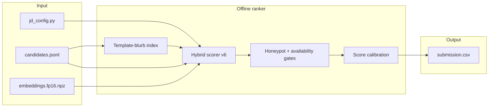
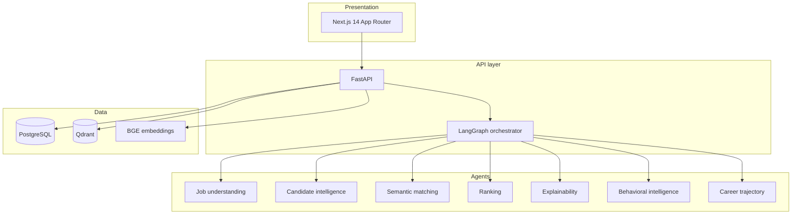

# RecruitGPT X

**Intelligent candidate discovery and ranking for the Redrob India Runs Data & AI Challenge — with an optional recruiter-facing product demo.**

RecruitGPT X answers a single hiring question with evidence, not keywords: *who fits this role, in what order, and why?* The repository contains two related systems that share a domain but serve different purposes. Judges and reproducibility reviewers should use the offline ranker path only.

| | |
|---|---|
| **Live demo** | **[recruitgpt-x.vercel.app](https://recruitgpt-x.vercel.app)** — recruiter dashboard, analytics, AI chat |
| **Repository** | [github.com/rahulx2001/recruitgpt-x](https://github.com/rahulx2001/recruitgpt-x) |
| **Sandbox** | [HuggingFace Space — sample ranker](https://huggingface.co/spaces/rahulsinghx2001/recruitgpt-ranker) |
| **Demo video** | [Walkthrough below](#demo-walkthrough) · [Google Drive](https://drive.google.com/file/d/1A_lDtpB1oP5CiYhAGqskR54T6SUcgtNk/view?usp=sharing) |
| **Judges** | Start with [JUDGES.md](JUDGES.md) (60-second orientation) |

---

## Demo walkthrough

~4-minute narrated walkthrough of our approach deck (Team **Schadn** · India Runs Data & AI Challenge).  
Play inline on GitHub:

https://github.com/rahulx2001/recruitgpt-x/blob/main/portal_upload/Schadn_Demo_Video_Final.mp4

Also available on Google Drive (anyone with the link):  
[https://drive.google.com/file/d/1A_lDtpB1oP5CiYhAGqskR54T6SUcgtNk/view?usp=sharing](https://drive.google.com/file/d/1A_lDtpB1oP5CiYhAGqskR54T6SUcgtNk/view?usp=sharing)

---

## Table of contents

1. [Demo walkthrough](#demo-walkthrough)
2. [Two systems, one repository](#two-systems-one-repository)
3. [Hackathon submission (graded)](#hackathon-submission-graded)
4. [Ranking methodology (v6)](#ranking-methodology-v6)
5. [Demo platform (optional)](#demo-platform-optional)
6. [Architecture](#architecture)
7. [Quick start](#quick-start)
8. [Repository layout](#repository-layout)
9. [Validation and reproduction](#validation-and-reproduction)
10. [Documentation](#documentation)
11. [AI disclosure](#ai-disclosure)

---

## Two systems, one repository

This project deliberately separates **what gets scored** from **what gets demonstrated**.

| System | Entry point | Purpose | Uses LLM at rank time? |
|--------|-------------|---------|------------------------|
| **Graded ranker** | `rank.py` → `submission.csv` | Challenge submission over 100K candidates | No |
| **Demo platform** | `backend/` + `frontend/` | Recruiter UI, chat, analytics, what-if | Yes (chat and agents only) |

The web application does **not** produce `submission.csv`. Running the dashboard and running the ranker are independent workflows. If you evaluate this project for the hackathon, use `rank.py` and the files listed in [JUDGES.md](JUDGES.md).

Submit the repository via `git clone` or `git archive`. Do not submit a raw folder zip with broken `data/` symlinks.

---

## Hackathon submission (graded)

### Deliverables

| Artifact | Description |
|----------|-------------|
| `submission.csv` | Top-100 candidates: `candidate_id`, `rank`, `score`, `reasoning` |
| `challenge/redrob_ranker.py` | Hybrid offline scoring engine (v6) |
| `data/embeddings/embeddings.fp16.npz` | Committed MiniLM-L6-v2 bi-encoder matrix (required) |
| `submission_metadata.yaml` | Team, compute, methodology, and sandbox metadata |
| `scripts/reproduce_ranking.sh` | Canonical Stage-3 reproduction script |

### One-command reproduction

```bash
./scripts/reproduce_ranking.sh
```

**Requirements:** official `data/candidates.jsonl` (not committed — mount or sync via `./scripts/sync_challenge_data.sh`).

**Constraints satisfied at rank time:**

- CPU only, no GPU
- No network calls (cross-encoder off, no hosted LLM)
- ~50–60 seconds on 100K candidates (includes template-blurb index pass)
- Byte-reproducible output verified by `scripts/verify_submission_artifact.py`

### Pre-submit checklist

```bash
python validate_submission.py submission.csv
python scripts/check_honeypots.py submission.csv
python scripts/mock_stage4_review.py submission.csv
python scripts/verify_submission_artifact.py --artifact ./submission.csv
python -m pytest challenge/test_ranker.py -q
```

### Portal export

```bash
RECROB_PARTICIPANT_ID=team_xxx ./scripts/finalize_submission.sh
```

### Docker (Stage 3)

```bash
docker compose -f docker-compose.ranker.yml build
docker compose -f docker-compose.ranker.yml run --rm ranker
```

---

## Ranking methodology (v6)

The ranker is a **hybrid, trap-aware scorer** built for the Senior AI Engineer JD at Redrob. It combines lexical signals, career semantics, a committed bi-encoder, behavioral modifiers, and explicit honeypot detection — without any LLM inference during the ranking step.

### Signal stack

| Signal | Weight | Role |
|--------|--------|------|
| Title alignment | 0.20 | Role evidence (Rec Sys, Search, ML Engineer) |
| Core IR skills | 0.18 | Embeddings, retrieval, vector DBs, ranking systems |
| Career semantic | 0.14 | Plain-language production stories in role descriptions |
| Production pedigree | 0.12 | Shipped systems vs. research-only or framework demos |
| Availability | 0.12 | Open-to-work, recency, response rate |
| Redrob assessments | 0.08 | Platform skill assessment scores |
| JD overlap | 0.06 | TF-IDF alignment with parsed JD |
| Experience band | 0.05 | 5–9 year ideal range |
| Location | 0.03 | Pune/Noida preference |
| Engagement | 0.05 | Saved-by-recruiters, interview completion |

### Trap and quality gates (v6)

1. **Template-blurb penalty** — demotes candidates sharing recycled career descriptions across the pool (`challenge/career_blurb.py`)
2. **Structural honeypots** — impossible tenure, expert skills at zero months, overlapping roles
3. **Availability hard gate** — `open_to_work=false` cannot reach top-10
4. **Notice-period modifier** — 90–120 day notice penalized; sub-30 day boosted
5. **Consulting and research penalties** — pure services career or research without production signals
6. **Cross-encoder off** — reproducibility and spec compliance (`RANKER_USE_CROSS_ENCODER=0`)

### Reasoning

Each row in `submission.csv` carries a **two-sentence justification**: specific profile facts, JD connection, and honest concerns (notice period, thin IR depth, availability). Reasoning is generated from grounded components, not from an LLM.

### Evaluation honesty

Offline metrics in `data/eval_report.json` are **diagnostics only** — not hidden ground truth. Synthetic proxy labels are rule-generated, not human-annotated. See [docs/evaluation_honesty_statement.md](docs/evaluation_honesty_statement.md).

---

## Demo platform (optional)

**Try it live:** [https://recruitgpt-x.vercel.app](https://recruitgpt-x.vercel.app)

The web stack is a **recruiter command center** for exploring rankings, shortlists, interviews, and AI-assisted explanations. It is designed for demos, interviews, and product narrative — not for producing the graded CSV.

### Capabilities

| Feature | Description |
|---------|-------------|
| Dashboard | Live workspace stats, pipeline, attention queue — all from backend APIs |
| Candidate profiles | Ranked shortlists with score breakdowns and reasoning |
| AI recruiter chat | Natural-language Q&A over cached rankings, with input guardrails |
| Analytics | Funnel, insights, and hiring metrics |
| What-if analysis | Adjust requirements and observe ranking shifts |
| Bias reporting | Surface demographic skew in shortlists |
| Interviews and calendar | Scheduling workflow and Google Calendar integration |

### Data note

| Source | Count | Used by |
|--------|-------|---------|
| `candidates.jsonl` | 100,000 | Offline ranker (`rank.py`) |
| SQLite seed (default) | 12 | Demo UI until import |
| Top-100 import | 100 | Dashboard aligned with `submission.csv` |

To load ranked challenge candidates into the dashboard:

```bash
./scripts/import-challenge-candidates.sh
```

---

## Architecture

### Graded path (submission)



### Demo path (web application)



For a full breakdown, see [docs/ARCHITECTURE.md](docs/ARCHITECTURE.md). Sections covering LangGraph and the web stack are explicitly labeled **demo only**.

---

## Quick start

### Prerequisites

- Python 3.11+
- Node.js 18+
- Official challenge bundle synced into `data/` (see `./scripts/sync_challenge_data.sh`)
- Docker (optional — Postgres, Qdrant, ranker container)

### A. Run the graded ranker

```bash
python rank.py --candidates ./data/candidates.jsonl --out ./submission.csv
```

### B. Run the demo application

**1. Environment**

```bash
cp backend/.env.example backend/.env
# Set OPENAI_API_KEY or ANTHROPIC_API_KEY in backend/.env for chat features
```

**2. Infrastructure (optional)**

```bash
docker compose up -d qdrant postgres
```

**3. Backend**

```bash
cd backend
python -m venv .venv && source .venv/bin/activate
pip install -r requirements.txt
python -m app.data.seed
uvicorn app.main:app --host 127.0.0.1 --port 8000
```

**4. Frontend**

```bash
cd frontend
npm install
npm run dev
```

Open [http://localhost:3000](http://localhost:3000). The API runs at [http://localhost:8000](http://localhost:8000).

---

## Repository layout

```
recruitgpt-x/
├── rank.py                    # CLI entry — produces submission.csv
├── submission.csv             # Committed top-100 artifact
├── submission_metadata.yaml   # Portal metadata
├── JUDGES.md                  # 60-second judge orientation
├── challenge/                 # Offline ranker (graded)
│   ├── redrob_ranker.py       # Hybrid scorer v6
│   ├── career_blurb.py        # Template deduplication
│   ├── honeypot.py            # Structural trap detection
│   └── jd_config.py           # Parsed JD requirements
├── data/
│   └── embeddings/            # Committed fp16 bi-encoder bundle
├── scripts/                   # Reproduction, validation, import
├── sandbox/                   # HuggingFace Space bundle
├── backend/                   # FastAPI + LangGraph (demo)
├── frontend/                  # Next.js recruiter UI (demo)
└── docs/                      # Architecture, API, evaluation, pitch
```

---

## Validation and reproduction

| Check | Command | Expected |
|-------|---------|----------|
| CSV format | `python validate_submission.py submission.csv` | Valid |
| Honeypots | `python scripts/check_honeypots.py submission.csv` | 0% in top-100 |
| Reasoning quality | `python scripts/mock_stage4_review.py submission.csv` | PASS |
| Byte reproducibility | `python scripts/verify_submission_artifact.py` | PASS |
| Unit tests | `python -m pytest challenge/test_ranker.py -q` | All pass |

Artifact hash is pinned in `data/SUBMISSION_ARTIFACT.sha256`.

---

## Documentation

| Document | Audience | Content |
|----------|----------|---------|
| [JUDGES.md](JUDGES.md) | Hackathon reviewers | What to run, what to ignore |
| [docs/judge_faq.md](docs/judge_faq.md) | Technical interview | Evidence-backed design answers |
| [docs/ARCHITECTURE.md](docs/ARCHITECTURE.md) | Engineers | System design (demo + ranker) |
| [docs/API.md](docs/API.md) | Integrators | FastAPI reference (demo backend) |
| [docs/EVALUATION.md](docs/EVALUATION.md) | Reviewers | Metrics and benchmarks |
| [docs/evaluation_honesty_statement.md](docs/evaluation_honesty_statement.md) | Reviewers | Proxy vs. hidden GT |
| [docs/evaluation_limitations.md](docs/evaluation_limitations.md) | Reviewers | What offline NDCG does not prove |
| [docs/DEPLOY.md](docs/DEPLOY.md) | Operators | Production deployment |
| [docs/DEMO_SCRIPT.md](docs/DEMO_SCRIPT.md) | Presenters | Live demo walkthrough |
| [sandbox/README.md](sandbox/README.md) | Sandbox deploy | HuggingFace Space setup |

---

## AI disclosure

Grok and Cursor were used for architecture discussion, code review, and implementation assistance. **No rows from `candidates.jsonl` were sent to any LLM during ranking.** The offline ranker runs entirely on CPU with no network calls. Chat and agent features in the demo application use LLMs separately from the submission pipeline.

Full declaration: [submission_metadata.yaml](submission_metadata.yaml).

---

## Built for

**India Runs Data & AI Challenge — Intelligent Candidate Discovery & Ranking** (Redrob)

Team: RecruitGPT X — Rahul Kumar Singh